[](#install)
[](.github/workflows/self-test.yml)
[](LICENSE)
[](PRIVACY.md)

**[Install](#install)** · **[What you get](#what-you-get)** · **[The script](#the-script)** · **[Privacy](#privacy)** · **[The Cairn family](#the-cairn-family)**

**Your AI product can look perfectly healthy while the numbers it shows are wrong.
Cairn Signals traces each number back to the code that produces it, and finds the silent
failures in between.**

The dangerous failures in an AI product throw no error and return no 500:

- **A confidence score fed by fields nothing writes.** In one production RAG product, the
  score could never reach "high" for months. Five of its inputs were never written, and a
  scorer returning 65% looks exactly like one that works.
- **A cost meter that meters and saves nothing.** Tracing was switched on only in debug
  mode, so real traffic recorded no cost at all.
- **A benchmark whose published case count was nearly four times what could run.**
  Placeholder values made half the cases skip themselves, and the published figure
  described a run nobody could repeat.
- **A failure that becomes a believable 0.** A broken query renders as "0 pending", which
  looks exactly like a real zero.
- **A retired model that fails into a fallback.** Every request quietly pays for two calls.

Cairn Signals is a skill for Claude Code. It traces each number to what writes it, and
ships a scanner that shows where to look first:



*Real output, from a small made-up app with planted problems.*

## Who it's for

If you've shipped an AI feature (a chatbot, a RAG search, an AI score or recommendation)
and put its numbers in front of users, investors or a customer, you have probably seen one
of these:

- A confidence score that never moves, or never reaches "high".
- An LLM bill that doesn't match your traffic, next to a cost dashboard that says $0.
- Evals that are always green, even after something broke.
- An accuracy figure on your site that nobody can re-run.

None of this means the model is bad. It means a number isn't connected to what it claims to
measure. You don't need to read the code to find out which. Ask in plain words:

- *"Can I trust the numbers our AI product shows? We're pitching investors next week."*
- *"Our LLM bill doubled but traffic didn't, and the cost dashboard says $0."*
- *"Our confidence score never goes above 70%. Why?"*
- *"Audit our RAG app before we publish our accuracy number."*

## What you get


| | |
|---|---|
| **A verdict for every number** | It lists each number users, admins or the public see, then traces every input back to what writes it. Each number is **real**, **partly real**, **fabricated**, or **can't tell** (with the query that would settle it). |
| **The silent failures, ranked by cost** | Scores built on fields nothing writes, failures that become 0, telemetry that only runs in debug, meter writes whose failures vanish, evals that can't fail, placeholder eval data, uncapped model calls and retries, and model ids nobody checks. |
| **Fixes proven to fail** | Each fix is one line: a log with identifiers, an "unavailable" state instead of 0, an assertion that a writer exists, an eval threshold that can be missed, or a cap. Each is broken once on purpose to prove it catches the problem. |
| **Honesty about published numbers** | Accuracy and benchmark claims are checked for a date, a runnable case count and a command that still reproduces them. |
| **A 0–10 score** | Every point cites evidence, and checks that don't apply to your product are marked N/A rather than scored 0. |

## How it compares

Cairn Signals asks one question: **are the numbers real?** These neighbouring jobs are
already well served, so it points to them rather than redoing them:

| Need | Use |
|---|---|
| Prompt injection, OWASP LLM Top 10 | Anthropic's `security-guidance`, `claude-code-owasp` |
| Designing evals, calibrating LLM judges | `evals-skills` |
| Adding tracing and observability | the Langfuse or MLflow plugins |
| Tuning chunking and retrieval | `claude-rag-skills` |
| **Whether each number your product shows is connected to what it claims to measure** | **Cairn Signals** |

## Install

```
/plugin marketplace add nicuk/llm-silent-failure-audit
/plugin install cairn-signals@cairn-signals
```

## The script

`skills/ai-signals-audit/scripts/scan_signals.py` finds where to look in a JS/TS or
Python codebase. It checks for scores fed by fields nothing writes, failures that return
0, errors swallowed near model or cost code, metrics defaulted to 0, telemetry behind a
debug flag, fire-and-forget meter writes, uncapped LLM calls, unbounded loops, evals that
can't fail, placeholder values in eval data, and hard-coded model ids.

```
python skills/ai-signals-audit/scripts/scan_signals.py --self-test
python skills/ai-signals-audit/scripts/scan_signals.py path/to/your/repo
```

It is a locator, not a judge. Each hit comes with the question to ask at that line, and
the skill turns hits into verdicts by reading the code. `--fail-on HIGH` makes it a CI
gate once you've triaged the findings.

The report is short by default. Every HIGH finding is listed in full, MEDIUM findings
show the first 5 per check, and INFO findings, such as model ids, become one summary line
per check. The totals always count everything. `--verbose` lists every finding, and
`--json` is always complete.

`--self-test` plants one defect for each check in a temporary folder and confirms every
check fires. A check that has never failed has never been tested. The self-test badge at
the top runs it on every push, along with a check that the scanner imports nothing that
can reach the network.

## What it runs, and what it doesn't

- The scanner only reads the source and data files under the path you give it.
- It writes nothing to your project. `--self-test` uses a temporary folder and deletes it.
- It makes no network requests and calls no model. There's no telemetry and no API key.
- When the skill reproduces a failure, it works on a copy, mocks every paid API, caps
  loops, runs under a timeout, and never kills processes by name.

## Evidence

**Case study:** [The confidence score that could never say "high"](https://github.com/nicuk/cairn-principles/blob/main/case-studies/signals-confidence-capped.md).

In testing, runs with the skill were compared with runs of the same model without it,
across three prompts:

- **A small made-up app with 8 planted problems.** Both conditions found almost
  everything. Only the runs with the skill proved their fixes, with checks that fail on the
  broken code and pass on the fixed copy.
- **A real production RAG codebase of about 1,000 files,** graded against an answer key
  written before the runs. The run with the skill found 5 of 5 items; the run without it
  found 2.5 of 5. The skill run also found the audit's highest-impact issue, which the
  other run missed.

Overall, runs with the skill passed 100% of the checks and runs without it passed 80%.
Treat this as a small test, not proof. The incidents behind every check are in
`skills/ai-signals-audit/references/incidents.md`.

## Privacy

Nothing is collected. See [PRIVACY.md](PRIVACY.md).

## The Cairn family

Three plugins built on one principle: **a claim with an enforcer stays true; a claim with
only an author rots.** Each one checks a different kind of claim.
[The principles, the evidence and the design decisions](https://github.com/nicuk/cairn-principles) are
in one place.

| Plugin | The question it answers |
|---|---|
| [Cairn Memory](https://github.com/nicuk/claude-md-memory-architecture) | Is what your agents remember cheap to load, and still true? |
| **Cairn Signals** (this one) | Are the numbers your AI product shows real? |
| [Cairn Verify](https://github.com/nicuk/did-ai-really-fix-it) | Did the AI really fix it? |

## Who made this

Built by [Nic Chin](https://nicchin.com/?ref=cairn-signals), who reviews AI products and
the apps built around them. If this audit found numbers you've already shown investors or
customers, an independent
[AI assurance review](https://nicchin.com/ai-assurance?ref=cairn-signals) covers the
parts a code scan can't see, such as production data and live traffic. The plugin is
free and complete either way. Nothing in it is held back.

## License

MIT
